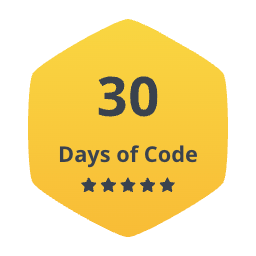

# HackerRank 30 Days of Code

## Details

Unlike most HackerRank contests, this challenge is solely to compete with and challenge yourself---not other hackers. Topics include if-else statements, recursion, data structures, object-oriented programming, running time, and testing!

## Badge

